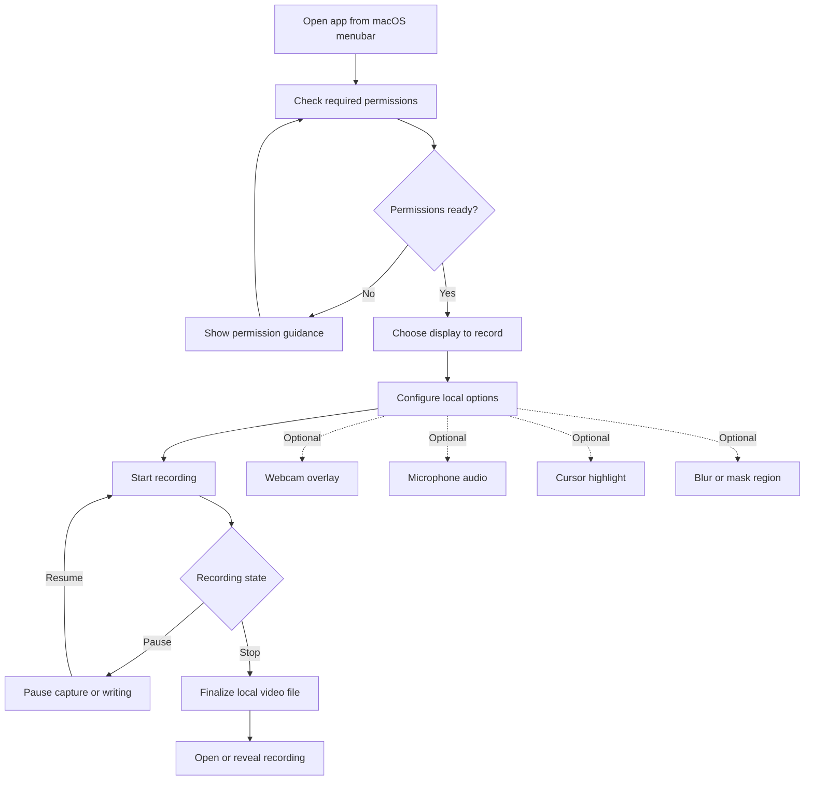
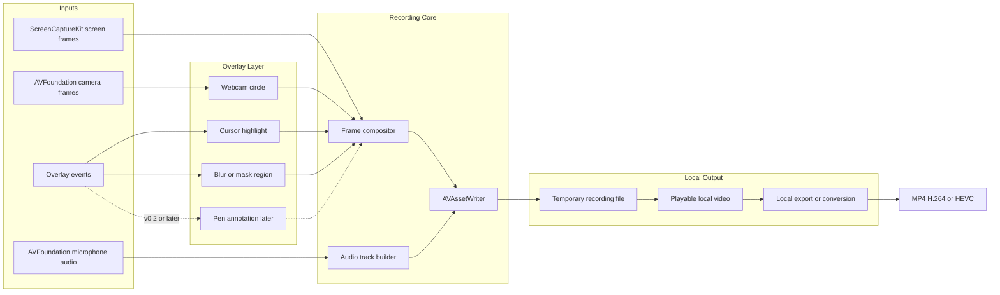

# LoomClone

LoomClone is a local-first macOS menubar screen recorder for personal use.

The first goal is not to recreate Loom as a cloud product. The first goal is to make a reliable personal recorder that can record the screen, optionally include camera and microphone, save the video locally, and never require an internet connection.

## Product Goal

Build a native macOS menubar app that can:

- record the screen
- show an optional circular webcam overlay
- record microphone audio
- pause and resume recording
- stop and save a local video file
- highlight the cursor
- hide sensitive areas with blur or mask regions
- export or convert the recording locally

The app should be useful for personal recording first. Cloud upload, sharing links, teams, comments, transcripts, and collaboration features are intentionally out of scope for the first version.

## Target User

The first target user is the developer/owner of this repo.

Typical use cases:

- record a coding session
- record a bug reproduction
- record a short product walkthrough
- record a tutorial for later sharing
- record private notes without uploading anything to a cloud service

## Principles

- Local first: recordings stay on the machine.
- No cloud dependency: the app should work offline.
- No account system in MVP.
- No analytics in MVP.
- Minimal, native macOS UI.
- Menubar-first workflow.
- Reliability before advanced editing.

## Proposed Tech Stack

- SwiftUI for app UI and settings.
- AppKit for menubar behavior, floating panels, and overlay windows where needed.
- ScreenCaptureKit for screen capture.
- AVFoundation for camera, microphone, file writing, and export.
- Core Image or Metal later if blur/compositing needs more control.

Initial target can be macOS 14+ to keep the first implementation simpler. This can be lowered later if there is a clear reason.

## MVP Scope

The MVP is considered successful when this flow works:

1. Open the app from the macOS menubar.
2. Choose a display to record.
3. Start recording.
4. Optionally show webcam as a circular overlay.
5. Optionally record microphone audio.
6. Pause and resume.
7. Stop recording.
8. Save a playable video file locally.
9. Open the result in Finder or QuickTime.

## Workflow Diagrams

### User Recording Flow

### Local Recording Pipeline

## Non-Goals for MVP

These are intentionally not part of the first version:

- cloud upload
- share links
- user accounts
- team workspace
- comments
- transcripts
- AI summaries
- browser extension
- Windows support
- mobile support
- full video editor
- multi-shape annotation tools

System audio recording is also not required for the first MVP. It can be evaluated later because it adds extra permission, routing, and reliability concerns.

## Annotation Decision

Annotation is wanted, but it should not block the first usable recorder.

For this project, annotation means drawing directly on top of the recording. The first annotation feature should be only a pen tool:

- freehand pen drawing
- choose pen color
- choose pen size
- clear drawings
- include drawings in the final video

No arrows, circles, rectangles, text labels, stickers, or complex editing tools are needed at first.

Recommended placement:

- MVP: no annotation
- v0.2 or v0.3: pen-only annotation

Why not include it immediately:

- the recording pipeline must first be stable
- annotation needs an overlay input layer
- strokes must be composited into the output video
- pause/resume and multi-display coordinates can make drawing sync more complicated

## Milestones

### Milestone 0: Repository and Project Foundation

Goal: create the basic app foundation and keep the product direction clear.

Issues:

- Create the initial macOS app project.
- Configure the app as a menubar-first app.
- Add a basic app icon placeholder.
- Define app module structure.
- Add initial README and roadmap.
- Add local-only privacy notes.
- Decide the minimum supported macOS version.

Suggested modules:

- `App`
- `MenuBar`
- `Permissions`
- `Recorder`
- `Camera`
- `Microphone`
- `Overlay`
- `Exporter`
- `Settings`

### Milestone 1: Menubar App Shell

Goal: make the app feel like a real menubar utility before recording is fully implemented.

Issues:

- Add menubar icon.
- Add idle, recording, and paused states.
- Add menu actions: Start, Pause, Resume, Stop, Open Last Recording, Settings, Quit.
- Add a small floating control bar shown during recording.
- Add recording timer.
- Add basic settings window.
- Add default save location setting.

Acceptance criteria:

- The app launches without a dock-first workflow.
- The user can control the recording state from the menubar.
- The user can see whether the app is idle, recording, or paused.

### Milestone 2: Screen Recording Core

Goal: record the screen and save a playable local video.

Issues:

- Request screen recording permission.
- Detect available displays.
- Let the user choose which display to record.
- Capture frames with ScreenCaptureKit.
- Write captured frames to a video file.
- Stop recording and finalize the file correctly.
- Generate automatic file names.
- Add "Open Last Recording".
- Add "Reveal in Finder".

Acceptance criteria:

- A screen-only recording can be started and stopped.
- The saved file is playable in QuickTime.
- The app handles permission denial clearly.

### Milestone 3: Microphone Recording

Goal: add voice recording and keep audio/video sync reliable.

Issues:

- Request microphone permission.
- List available microphone inputs.
- Add microphone on/off setting.
- Record microphone audio with the screen video.
- Verify audio and video stay in sync.
- Handle microphone permission denial.

Acceptance criteria:

- A screen + microphone recording can be saved locally.
- The output file plays with synchronized audio.

### Milestone 4: Webcam Overlay

Goal: add camera overlay similar to a simple Loom-style personal recorder.

Issues:

- Request camera permission.
- Show webcam preview.
- Render webcam as a circular overlay.
- Support corner positions: top-left, top-right, bottom-left, bottom-right.
- Support small, medium, and large webcam sizes.
- Add webcam on/off setting.
- Include webcam overlay in the saved video.

Acceptance criteria:

- The webcam appears as a circular overlay while recording.
- The saved video includes the webcam overlay.
- The overlay position is predictable on the selected display.

### Milestone 5: Pause and Resume

Goal: make pause/resume reliable without corrupting the final file.

Issues:

- Add pause action.
- Add resume action.
- Keep elapsed recording time accurate.
- Prevent timestamp gaps or broken output files.
- Evaluate segment-based recording if direct pause/resume is unstable.
- Add basic recovery for interrupted recordings.

Acceptance criteria:

- The user can pause and resume at least several times in one recording.
- The final file remains playable.
- Audio and video remain in sync after resume.

### Milestone 6: Cursor Highlight

Goal: make recordings easier to follow.

Issues:

- Track cursor position on the selected display.
- Add circular cursor highlight.
- Add click ripple effect.
- Add settings for highlight color and size.
- Add setting to enable or disable cursor highlight.
- Verify coordinate accuracy on Retina displays.
- Verify behavior with external monitors.

Acceptance criteria:

- Cursor highlight appears in the final recording.
- Clicks are visible enough for tutorials and bug reports.
- The feature can be turned off.

### Milestone 7: Blur or Mask Region

Goal: let the user hide sensitive areas during recording.

Issues:

- Add a blur/mask overlay region.
- Let the user move and resize the region before recording.
- Let the user move and resize the region during recording if feasible.
- Support multiple regions later if the first version is stable.
- Start with a solid mask if real-time blur is too costly.
- Evaluate true blur compositing after the basic mask works.

Acceptance criteria:

- The user can hide at least one rectangular area.
- The hidden area is included in the final video.
- The feature is stable enough for private information on screen.

### Milestone 8: Local Export and Conversion

Goal: create practical output files without using a server.

Issues:

- Export to MP4 with H.264.
- Add quality presets: Small, Balanced, High.
- Add optional HEVC export if supported.
- Show export progress.
- Keep original recording until export succeeds.
- Add simple error handling for export failure.

Acceptance criteria:

- The user can create an MP4 file suitable for sharing manually.
- Export happens locally.
- Failed export does not destroy the original recording.

### Milestone 9: Pen-Only Annotation

Goal: add the simplest annotation feature that is actually useful.

Issues:

- Add annotation mode toggle.
- Add pen drawing overlay.
- Support pen color.
- Support pen size.
- Add clear drawing action.
- Include pen strokes in the final video.
- Verify drawing coordinates on Retina and external displays.
- Decide whether drawings persist until cleared or fade after a few seconds.

Acceptance criteria:

- The user can draw freehand while recording.
- The drawing appears in the final video.
- Annotation can be turned off quickly.

### Milestone 10: Personal Release Polish

Goal: make the app comfortable for daily personal use.

Issues:

- Add onboarding for screen, camera, and microphone permissions.
- Improve error messages.
- Add keyboard shortcuts.
- Add long-recording test for 30 minutes.
- Add long-recording test for 60 minutes.
- Test external monitor workflows.
- Test disk-space error handling.
- Add basic app signing.
- Add a manual release checklist.

Acceptance criteria:

- The app is stable enough for regular personal recordings.
- Common permission and recording errors are understandable.
- The user can recover from simple failures.

## Future Commercial Scope

Only after the personal app works well:

- license or paid unlock
- auto update
- optional crash reporting
- nicer onboarding
- more export presets
- lightweight trimming
- keyboard shortcut customization
- better annotation tools
- notarized releases
- product website

Cloud upload and share links should be treated as a separate product direction, not a small feature.

## Suggested First Build Order

1. Menubar shell.
2. Screen-only recording.
3. Local save and open file.
4. Microphone.
5. Webcam overlay.
6. Pause/resume.
7. Cursor highlight.
8. Blur/mask region.
9. Local export presets.
10. Pen-only annotation.

The first working version should be boring but reliable: press record, stop, get a playable file.
